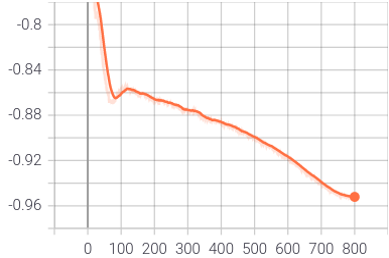

# SimSiam
This is an unofficial Pytorch implementation of the paper [Exploring Simple Siamese Representation Learning](https://arxiv.org/abs/2011.10566).
 The code has prepared to train on CIFAR10 dataset.
 This implementation only supports single-gpu training. Multi-gpu or DistributedDataParallel training is not supported currently.
 KNN classification accuracy and the linear evaluation results on CIFAR10 using this repo are matched with the reported results on "CIFAR Experiments" section in the paper.

## Self-Supervised training
To do unsupervised pre-training of a  CIFAR variant of ResNet-18 model on CIFAR10 in an single-gpu machine, run:  
`python main.py --data_root [Root directory of dataset where directory cifar-10-batches-py exists]`  `--arch resnet18 --learning_rate 0.06 --epochs 800 --weight_decay 5e-4 --momentum 0.9 --batch_size 512 --gpu 0`
  This script uses all the default hyper-parameters as described in the paper.

## Observations
The figure below shows the training loss plot. 

KNN classifier can serve as a monitor of the training progress. Left figure plots the validation accuracy of a KNN classifier (k=1) using this repo. Right figure is coresponding plot which was reported in "CIFAR Experiments" section in the paper. 
||

## Linear evaluation
With a pre-trained model, to train a supervised linear classifier on frozen features/weights, run:  
`python main_lincls.py --arch resnet18 --num_cls 10 --batch_size 256 --lr 30.0 --weight_decay 0.0` `--pretrained [your checkpoint path] [Root directory of dataset where directory cifar-10-batches-py exists]`
  
Linear classification results on CIFAR10 using this repo with one GPU:
| Model | Pre-train epochs | Top-1 acc. (paper) | Top-1 acc. (ours)| Pre-train weights |
| :---: | :---: | :---: | :---:| :---: |
|ResNet-18| 800 | 91.8 | 91.94 | [download](https://drive.google.com/file/d/17_0uXiTbeUsRhwI0TDgGnj45eLWmXO2c/view?usp=sharing) |
